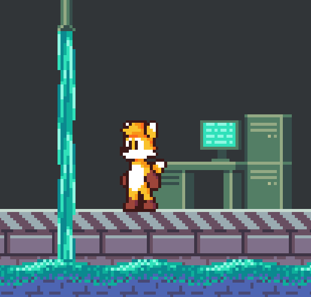

+++
title = "Ada's GameDev portfolio"
path = "portfolio"
template = "page.html"
+++
## Untitled truck game

Simple game where you plan optimal routes for delivery trucks based on customer needs.

{{resize_image(path="pages/portfolio/truck_game_roads.png", alt="Map inside Blender")}}
Defining roads as paths inside Blender.

<video width="100%" height="auto" autoplay muted loop>
    <source src="TruckGameDev.webm" type="video/webm">
</video>
Roads extracted from GLTF file and interactable inside Bevy.

<video width="100%" height="auto" autoplay muted loop>
    <source src="TruckGameRender.webm" type="video/webm">
</video>
A cool render of the city I generated for this project.

## Untitled castle game

{{resize_image(path="pages/portfolio/castle_trees.jpg", alt="Castle game")}}

Experimental raymarching renderer for [Bevy](https://bevyengine.org/).

### Performance

<video width="100%" height="auto" autoplay muted loop>
    <source src="CastleFsr.webm" type="video/webm">
</video>
AMD FidelityFX Super Resolution 1.0 provides a nice boost to FPS.

{{resize_image(path="pages/portfolio/castle_no_bvh.png", alt="Castle game")}}
Even with FSR, the renderer still struggles when there are too many objects.

{{resize_image(path="pages/portfolio/castle_bvh_debug.png", alt="Castle game")}}
BVH lookup was implemented to limit the amount of raymarched objects per ray.
This provided a solid FPS increase.

{{resize_image(path="pages/portfolio/castle_bvh.jpg", alt="Castle game")}}
No we can have many towers :)

### Visuals

<video width="100%" height="auto" autoplay muted loop>
    <source src="CastleSky.webm" type="video/webm">
</video>
The sky simulates rayleigh scattering, inspired by [this video](https://www.youtube.com/watch?v=DxfEbulyFcY).

<video width="100%" height="auto" autoplay muted loop>
    <source src="CastleWater.webm" type="video/webm">
</video>
The water is still work-in-progress.

## Pressure

Cute game my fiancé and I made for [Ludum Dare 50](https://ldjam.com/events/ludum-dare/50/pressure)

## Other stuff

<video width="100%" height="auto" autoplay muted loop>
    <source src="SdfModelerRender.webm" type="video/webm">
</video>
<video width="100%" height="auto" autoplay muted loop>
    <source src="SdfModelerNodes.webm" type="video/webm">
</video>
<video width="100%" height="auto" autoplay muted loop>
    <source src="WeirdThing.webm" type="video/webm">
</video>

Oh and I also draw sometimes:
{{resize_image(path="pages/portfolio/karl.jpg", alt="A drawing of a dog")}}